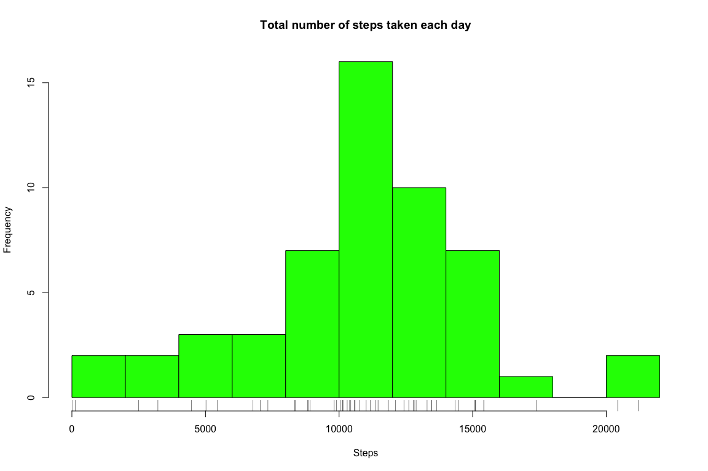
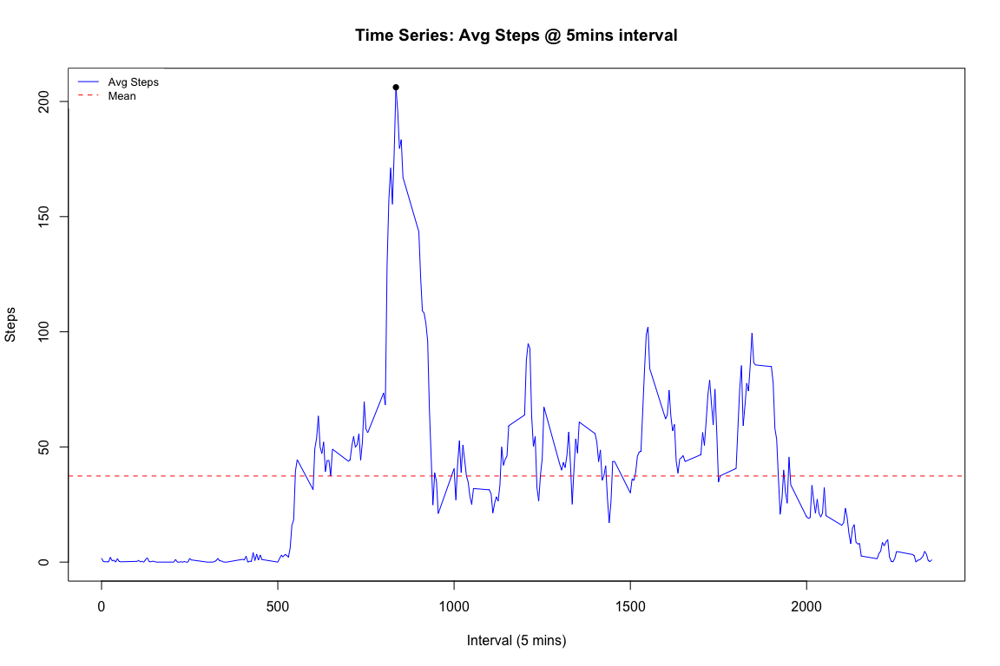
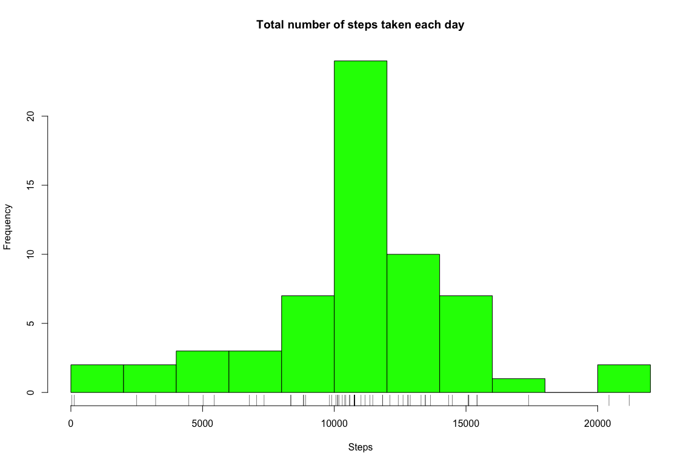
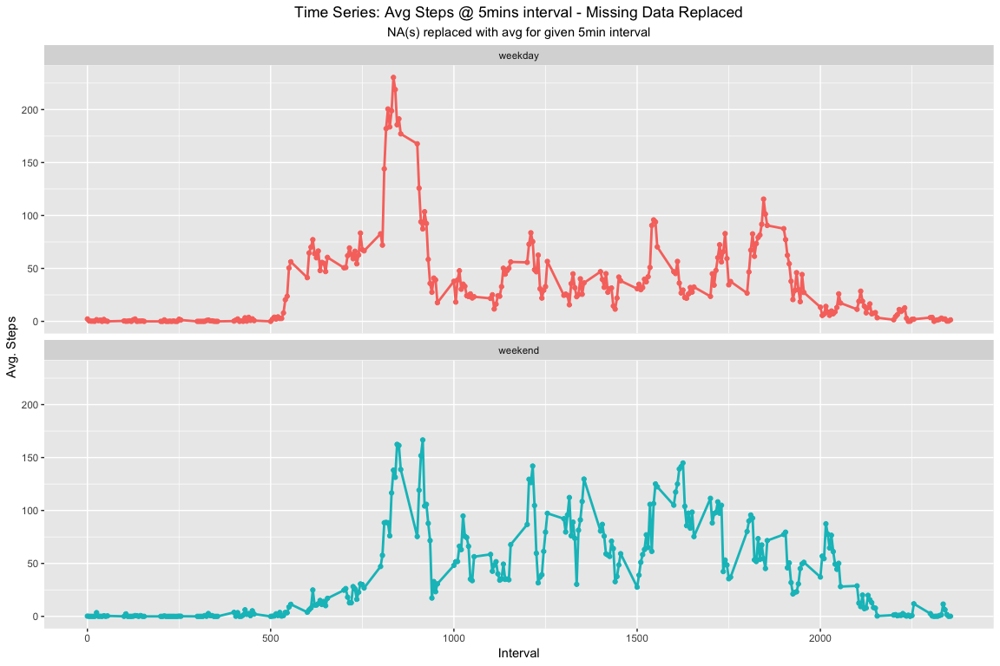

## 1. Loading and preprocessing the data


```r
# 1. Load the data (i.e. read.csv())
setwd("~/datascience")
df <- read.csv("data/activity.csv")
# 2. Process/transform the data (if necessary) into a format suitable for your analysis
df$date <- as.Date(df$date, format = "%Y-%m-%d")
str(df)
```

```
## 'data.frame':	17568 obs. of  3 variables:
##  $ steps   : int  NA NA NA NA NA NA NA NA NA NA ...
##  $ date    : Date, format: "2012-10-01" "2012-10-01" ...
##  $ interval: int  0 5 10 15 20 25 30 35 40 45 ...
```

```r
summary(df)
```

```
##      steps             date               interval     
##  Min.   :  0.00   Min.   :2012-10-01   Min.   :   0.0  
##  1st Qu.:  0.00   1st Qu.:2012-10-16   1st Qu.: 588.8  
##  Median :  0.00   Median :2012-10-31   Median :1177.5  
##  Mean   : 37.38   Mean   :2012-10-31   Mean   :1177.5  
##  3rd Qu.: 12.00   3rd Qu.:2012-11-15   3rd Qu.:1766.2  
##  Max.   :806.00   Max.   :2012-11-30   Max.   :2355.0  
##  NA's   :2304
```

## 2. What is mean total number of steps taken per day?


```r
# 1. Calculate the total number of steps taken per day

df_steps_per_day <- group_by(df, date) %>% summarise(sum(steps))
names(df_steps_per_day) <- c("date", "steps")
summary(df_steps_per_day$steps)
```

```
##    Min. 1st Qu.  Median    Mean 3rd Qu.    Max.    NA's 
##      41    8841   10765   10766   13294   21194       8
```

```r
# 2. histogram of the total number of steps taken each day
hist(df_steps_per_day$steps, col = "green", breaks = 10, xlab = "Steps", 
     main = "Total number of steps taken each day")
rug(df_steps_per_day$steps)
```

<!-- -->

```r
# 3. Calculate and report the mean and median of the total number of steps taken per day
# using summary to quickly get median and mean values
mean(df_steps_per_day$steps, na.rm = TRUE)
```

```
## [1] 10766.19
```

```r
median(df_steps_per_day$steps, na.rm = TRUE)
```

```
## [1] 10765
```
## 3. What is the average daily activity pattern?


```r
# 1. Make a time series plot (i.e. type = "l") of the 5-minute interval (x-axis)
#   and the average number of steps taken, averaged across all days (y-axis)

df_by_interval <- group_by(df, interval)
df_by_interval_avg <- summarise(df_by_interval, mean(steps, na.rm = TRUE))
names(df_by_interval_avg) <- c("interval", "steps")
summary(df_by_interval_avg$steps)
```

```
##    Min. 1st Qu.  Median    Mean 3rd Qu.    Max. 
##   0.000   2.486  34.113  37.383  52.835 206.170
```

```r
with(df_by_interval_avg, plot(df_by_interval_avg$interval, df_by_interval_avg$steps,
  type = "l",
  xlab = "Interval (5 mins)",
  ylab = "Steps",
  pch = 19,
  col = "blue"
))
abline(h = mean(df_by_interval_avg$steps), col = "red", lty = 2)
title(main = "Time Series: Avg Steps @ 5mins interval")

legend("topleft",
  legend = c("Avg Steps", "Mean"),
  col = c("blue", "red"), lty = c(1, 2), cex = 0.8,
  text.font = 1, box.lty = 0
)

# Interval with max number of steps 
max_point <- filter(df_by_interval_avg, df_by_interval_avg$steps == max(df_by_interval_avg$steps))
points(x = max_point[1, 1], y = max_point[1, 2], pch = 16)
```

<!-- -->

```r
# 2. Which 5-minute interval, on average across all the days in the dataset, 
#   contains the maximum number of steps?
# Interval with max steps:
max_point[1, 1]
```

```
## # A tibble: 1 x 1
##   interval
##      <int>
## 1      835
```

```r
print(max_point)
```

```
## # A tibble: 1 x 2
##   interval steps
##      <int> <dbl>
## 1      835  206.
```

## 4. Inputing missing values


```r
# 1 Calculate and report the total number of missing values in the dataset (i.e. 
# the total number of rows with NAs)
sum(!complete.cases(df))
```

```
## [1] 2304
```

```r
# ALl NA(s) are in steps variable
sum(is.na(df$steps))
```

```
## [1] 2304
```

```r
# 2 Devise a strategy for filling in all of the missing values in the dataset. 
#   The strategy does not need to be sophisticated. For example, you could use 
#     the mean/median for that day, or the mean for that 5-minute interval, etc.
#   
#   Ans: Strategy Selected for Replacing Missing Values: mean for that 5-minute interval

# 3 Create a new dataset that is equal to the original dataset but with the 
#   missing data filled in.
new_df <- df
data <- data.frame()
for (r in 1:nrow(new_df)) {
  data_point_step <- (new_df[r, 1])
  data_point_date <- (new_df[r, 2])
  data_point_interval <- (new_df[r, 3])

    if (is.na(data_point_step)) {
      data <- filter(df_by_interval_avg, interval == data_point_interval)
      new_df[r, 1] <- data[1,2]
    }
}

## NA(s) replaced with avg for given interval
sum(is.na(new_df$steps))
```

```
## [1] 0
```

```r
new_df_steps_per_day <- group_by(new_df, date) %>% summarise(sum(steps))
names(new_df_steps_per_day) <- c("date", "steps")

# Summary new dataset
summary(new_df_steps_per_day$steps)
```

```
##    Min. 1st Qu.  Median    Mean 3rd Qu.    Max. 
##      41    9819   10766   10766   12811   21194
```

```r
# 4. Make a histogram of the total number of steps taken each day and Calculate 
#   and report the mean and median total number of steps taken per day. Do these 
#   values differ from the estimates from the first part of the assignment? 
#   What is the impact of imputing missing data on the estimates of the total 
#   daily number of steps?

hist(new_df_steps_per_day$steps, col = "green", breaks = 10, 
     xlab = "Steps", main = "Total number of steps taken each day")
rug(new_df_steps_per_day$steps)
```

<!-- -->

```r
# Do these values differ from the estimates from the first part of the assignment? 
#   What is the impact of imputing missing data on the estimates of the total 
#   daily number of steps?

# Yes there is a difference in the median but none in the mean. 
# The median shifted by 1 step, see corresponding summary for both datasets below. 
# 
# df_steps_per_day : based original dataset NO REPLACEMENT OF "NA(s)"
summary(df_steps_per_day$steps)
```

```
##    Min. 1st Qu.  Median    Mean 3rd Qu.    Max.    NA's 
##      41    8841   10765   10766   13294   21194       8
```

```r
# new_df_steps_per_day : based new dataset WITH REPLACEMENT OF "NA(s)"
summary(new_df_steps_per_day$steps)
```

```
##    Min. 1st Qu.  Median    Mean 3rd Qu.    Max. 
##      41    9819   10766   10766   12811   21194
```
## 5. Are there differences in activity patterns between weekdays and weekends?


```r
# 1. Create a new factor variable in the dataset with two levels – “weekday” and
#  “weekend” indicating whether a given date is a weekday or weekend day.
new_df$type <- "weekday"
new_df$type[weekdays(as.Date(new_df$date), abbreviate = TRUE) %in% c("Sat","Sun")] <- "weekend"
new_df <- transform(new_df, type = factor(type))
summary(filter(new_df, type == "weekday")$steps)
```

```
##    Min. 1st Qu.  Median    Mean 3rd Qu.    Max. 
##    0.00    0.00    0.00   35.61   24.00  806.00
```

```r
summary(filter(new_df, type == "weekend")$steps)
```

```
##    Min. 1st Qu.  Median    Mean 3rd Qu.    Max. 
##    0.00    0.00    0.00   42.37   35.47  785.00
```

```r
new_df_by_type_interval <- group_by(new_df, type,interval)
new_df_by_type_interval_avg <- summarise(new_df_by_type_interval, mean(steps))
names(new_df_by_type_interval_avg) <- c("type","interval", "steps")

# 2. Make a panel plot containing a time series plot (i.e. type="l") of the 
#   5-minute interval (x-axis) and the average number of steps taken, averaged 
#   across all weekday days or weekend days (y-axis). See the README file in the
#    GitHub repository to see an example of what this plot should look like 
#    using simulated data.
  qplot(interval, steps,
    data = new_df_by_type_interval_avg,
     color = type
  ) +
    labs(
      subtitle = "NA(s) replaced with avg for given 5min interval",
      title = "Time Series: Avg Steps @ 5mins interval - Missing Data Replaced"
    ) +
    theme(plot.title = element_text(hjust = 0.5), legend.position = "none", plot.subtitle = element_text(hjust = 0.5)) +
    xlab(label = "Interval") +
    ylab(label = "Avg. Steps") +

    geom_line(size = 1) + facet_wrap(. ~ type, nrow = 2, ncol = 1)
```

<!-- -->

```r
  # Are there differences in activity patterns between weekdays and weekends?
  # 
  #  Yes there are visual differences you can easily observed from the graph above.
  #  The mean and median during the weekend are all higher on weekends than
  #   on weekdays. There is also more steps recorded in the morning's during the
  #   weekday as opposed to weekends. 

  summary(filter(new_df_by_type_interval_avg, type == "weekday")$steps)
```

```
##    Min. 1st Qu.  Median    Mean 3rd Qu.    Max. 
##   0.000   2.247  25.803  35.611  50.854 230.378
```

```r
  summary(filter(new_df_by_type_interval_avg, type == "weekend")$steps)
```

```
##    Min. 1st Qu.  Median    Mean 3rd Qu.    Max. 
##   0.000   1.241  32.340  42.366  74.654 166.639
```
